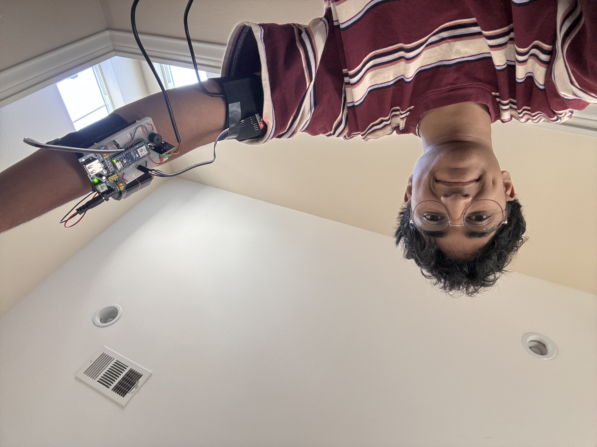
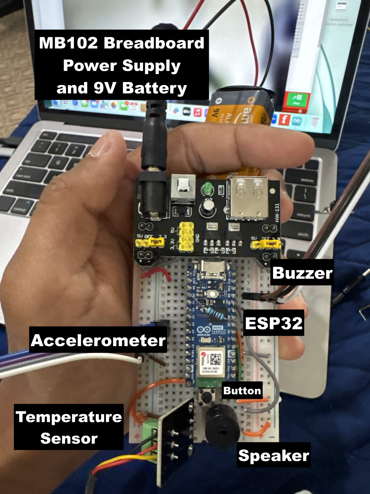
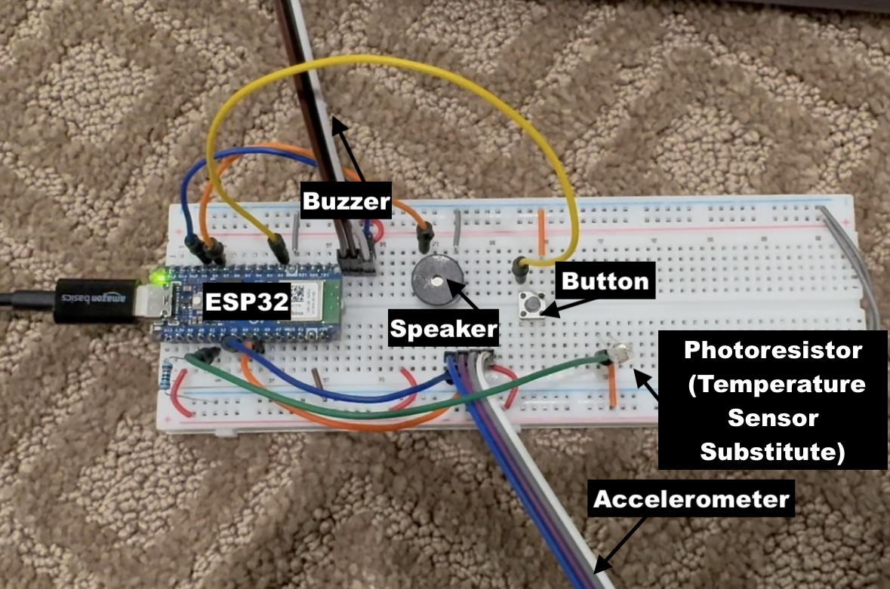
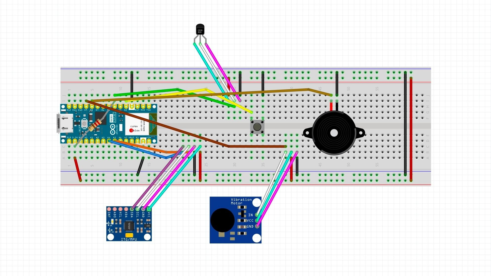
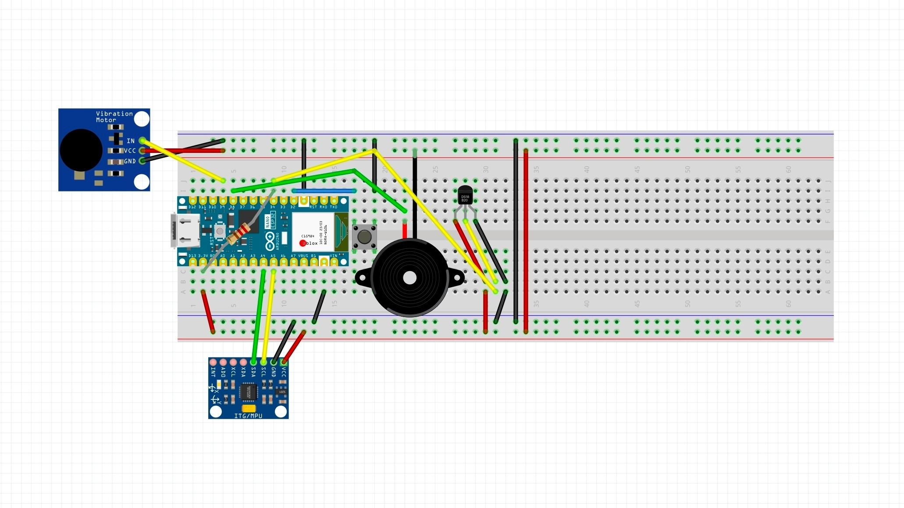

# Armband Health Sensor
My project is a wearable armband that can sense when someone who is supposed to limit their mobility overextends their arm, as well as let them know about the safety of their specific temperature circumstance. Using a temperature sensor and accelerometer to detect the arms movement, a speaker and buzzer go off with different patterns to alert the wearer on what is happening. This project held many challenges and learning curves due to the many components, but it was also extremely entertaining to work on as well as fufilling because it made a device that was applicable for the health field and was effective. 


| **Engineer** | **School** | **Area of Interest** | **Grade** |
|:--:|:--:|:--:|:--:|
| Sai C | San Juan Hills High School | Biomedical Engineering | Incoming Senior



  
# Final Milestone

<iframe width="560" height="315" src="https://www.youtube.com/embed/mkfCAKe8cRQ?si=ZnPZxq0ZSNdA2tUj" title="YouTube video player" frameborder="0" allow="accelerometer; autoplay; clipboard-write; encrypted-media; gyroscope; picture-in-picture; web-share" referrerpolicy="strict-origin-when-cross-origin" allowfullscreen></iframe>

  Since my previous milestone, I have adapted the breadboard to be more compact so that it fits on a smaller board in order for it to be easier for the armband wearer. Along with this, I began to use a 9 Volt battery to power my Arduino, rather than keeping it plugged into my computer, and I adjusted the coding and the sensor thresholds to work with the new configuration. 
  
  Some of the biggest challenges I faced during my time at BlueStamp Engineering were pushing through the basic hurdles of electrical engineering, as it was a new concept for me, and I found that working with all the components and making sure everything runs smoothly was a pretty daunting task. I overcame these struggles, however, through troubleshooting to address the root of the problem in each scenario, and I achieved many triumphs as a result, when I was able to piece together the whole board. 
  
  To summarize the key topics I learnt from this program, I learnt about basic breadboard engineering, as well as how Arduino sensors work, and how specific components work such as the accelerometer, and temperature sensor. Overall, all of this made me feel a lot more familiar with simple electrical engineering. 
  In the future, I hope to use the skills I learnt at BlueStamp and apply them to work in the medical field, as I am interested in Biomedical Engineering. I am super grateful to this program and all it has provided for me, and I will take this knowledge with me in the future. 
  
  Here is what my board looked like at the end:



# First and Second Milestone

<iframe width="560" height="315" src="https://www.youtube.com/embed/irftEeXKm-8?si=p30fPgPAIGEOktNe" title="YouTube video player" frameborder="0" allow="accelerometer; autoplay; clipboard-write; encrypted-media; gyroscope; picture-in-picture; web-share" referrerpolicy="strict-origin-when-cross-origin" allowfullscreen></iframe>

  My project is an armband that is aimed to recognize when someone who is supposed to have limited mobility (due to surgery, broken bones, etc.) moves their arm past a certain threshold as well as when they are in unsafe temperature conditions.  The components of my project include an Arduino Nano ESP32, a DS18B20 Temperature Sensor, an Accelerometer, a Piezo Speaker, and a Vibration buzzer. 
  
  Through both milestones, I was able to not only test the components individually (including a Force Resistive Sensor that I did not end up using at this stage), but I also connected each one and made the base of the device, in which both the temperature sensor and accelerometer set off the speaker and buzzer to alert the armband wearer if they are in too hot of a condition, are moving their arm too much, or both. 
  
  Some challenges I faced when making this project include the accelerometer not registering with the Arduino, and through many tests I was eventually able to figure out with the help of my instructors that the issue was stemming from the fact the A4 and A5 pins on my ESP32 were not working, and this was important because they are the only pins that work with the accelerometer. To fix this, we ordered a new ESP32 with working pins. The next issue I struggled with was the temperature sensor, as the DS18B20 was not working with the Nano, so for the time being I replaced the temperature sensor with a photoresister which measures ambient lighting for proof of concept, and in my video I demonstrate how I used the measurements taken to create a "Fake Temperature" which transfers the data found from the lighting into a readable temperature. 
  
  My second milestone was completing the board and combining all the components on my breadboard, and I displayed this in my video. Each of the sensors trigger a certain pattern in the buzzer and speaker based on if they pass the "dangerous" threshold for the armband wearer, and there is a pattern for if both are occurring. 
  
  Something that has been surprising about the project so far is that it has really taught me how to troubleshoot errors, because my project so heavily relies on multiple different components, and if one doesn't work it sets off the rest of the project, so I did not expect for that to be such a large learning curve for me. To complete my final milestone, I am hoping to figure out my temperature sensor and add it back in, as well as attach my board to the armband apparatus, and figure out the logistics of that. 
  
  Here is what my board looked like at this stage:



# Schematic 

Initial Schematic (To Test Device)


Final Schematic (Compressed and Simplified)



# Code

```c++
#include <Wire.h>                 // For MPU6050 accelerometer communication

#include <OneWire.h>              // For DS18B20 temperature sensor

#include <DallasTemperature.h>    // Easier DS18B20 temperature readings
 // -------------------- PINS --------------------
const int motorPin = D9; // Vibration motor pin
const int buzzerPin = D8; // Piezo buzzer pin
const int buttonPin = D2; // Button pin
const int tempPin = D4; // DS18B20 data pin
// -------------------- MPU6050 --------------------
const int MPU_ADDR = 0x68; // MPU6050 default I2C address
bool accelFound = false; // Tracks if MPU6050 was detected
int16_t baseX, baseY, baseZ; // Starting/normal position
// -------------------- DS18B20 TEMP SENSOR --------------------
OneWire oneWire(tempPin); // OneWire connection on D4
DallasTemperature tempSensor( & oneWire); // Temperature sensor object
// -------------------- ALERT STATES --------------------
bool motionAlert = false; // True when motion alert is active
bool tempAlert = false; // True when temp alert is active
bool alertsMuted = false; // True after button press mutes alert
// -------------------- THRESHOLDS --------------------
// Same idea as raw threshold of 12000.
// 12000 / 16384 = about 0.73g
const float motionThresholdG = 0.73;
// Temperature range
const float lowTempC = 35.0;
const float highTempC = 38.0;
// -------------------- SETUP --------------------
void setup() {
    Serial.begin(115200); // Start Serial Monitor
    delay(2000); // Wait before starting
    pinMode(motorPin, OUTPUT); // Motor output
    pinMode(buzzerPin, OUTPUT); // Buzzer output
    pinMode(buttonPin, INPUT_PULLUP); // Button uses internal pull-up
    digitalWrite(motorPin, LOW); // Motor off
    noTone(buzzerPin); // Buzzer off
    Serial.println("Patient alert project starting...");
    // Start temperature sensor
    tempSensor.begin();
    Serial.print("DS18B20 sensors found: ");
    Serial.println(tempSensor.getDeviceCount());
    // Start accelerometer
    Wire.begin();
    // Check if MPU6050 is connected
    Wire.beginTransmission(MPU_ADDR);
    byte error = Wire.endTransmission();
    if (error == 0) {
        Serial.println("MPU6050 found!");
        accelFound = true;
        // Wake up MPU6050
        Wire.beginTransmission(MPU_ADDR);
        Wire.write(0x6B); // Power management register
        Wire.write(0); // Wake up sensor
        Wire.endTransmission();
        delay(500);
        // Save current position as normal
        readAccelerometer(baseX, baseY, baseZ);
    } else {
        Serial.println("MPU6050 not found. Motion alert disabled.");
        accelFound = false;
    }
}
// -------------------- MAIN LOOP --------------------
void loop() {
    // Button click stops/mutes the current alert
    if (buttonPressed()) {
        clearAlerts();
        alertsMuted = true;
        Serial.println("Alerts muted by button.");
        delay(500); // Simple debounce
        return;
    }
    checkMotion(); // Check motion
    checkTemperature(); // Check real DS18B20 temperature
    // If nothing is wrong anymore, allow future alerts again
    if (!motionAlert && !tempAlert) {
        alertsMuted = false;
    }
    // If alert was muted, keep outputs off
    if (alertsMuted) {
        stopOutputs();
        delay(100);
        return;
    }
    // Choose alert pattern
    if (motionAlert && tempAlert) {
        playBothAlert(); // Continuous beep
    } else if (motionAlert) {
        playMotionAlert(); // Long beep pattern
    } else if (tempAlert) {
        playTempAlert(); // Double beep pattern
    } else {
        stopOutputs(); // No alert
    }
    delay(100);
}
// -------------------- MOTION CHECK --------------------
void checkMotion() {
    if (!accelFound) return; // Skip if accelerometer missing
    int16_t x, y, z; // Current X/Y/Z values
    readAccelerometer(x, y, z); // Read accelerometer
    // Compare current position to starting position
    int rawMovement = abs(x - baseX) + abs(y - baseY) + abs(z - baseZ);
    // Convert raw MPU6050 movement to approximate g units
    float movementG = rawMovement / 16384.0;
    Serial.print("Movement G: ");
    Serial.println(movementG);
    // Trigger alert if movement is above threshold
    if (movementG > motionThresholdG) {
        motionAlert = true;
    }
}
// -------------------- TEMPERATURE CHECK --------------------
void checkTemperature() {
    tempSensor.requestTemperatures(); // Ask DS18B20 for temp
    float tempC = tempSensor.getTempCByIndex(0); // Read first sensor
    Serial.print("Temp C: ");
    Serial.println(tempC);
    // -127 means sensor is disconnected/not detected
    if (tempC == DEVICE_DISCONNECTED_C) {
        Serial.println("Temperature sensor not detected!");
        tempAlert = true;
        return;
    }
    // Trigger temp alert if outside range
    if (tempC < lowTempC || tempC > highTempC) {
        tempAlert = true;
    }
}
// -------------------- ALERT PATTERNS --------------------
void playMotionAlert() {
    // Pattern: beeeep ... beeeep ... beeeep
    digitalWrite(motorPin, HIGH);
    tone(buzzerPin, 1000);
    delay(600);
    digitalWrite(motorPin, LOW);
    noTone(buzzerPin);
    delay(400);
}
void playTempAlert() {
    // Pattern: beepbeep ... beepbeep ... beepbeep
    for (int i = 0; i < 2; i++) {
        digitalWrite(motorPin, HIGH);
        tone(buzzerPin, 1500);
        delay(150);
        digitalWrite(motorPin, LOW);
        noTone(buzzerPin);
        delay(150);
    }
    delay(500);
}
void playBothAlert() {
    // Pattern: continuous beeeeeeeeeep
    digitalWrite(motorPin, HIGH);
    tone(buzzerPin, 2000);
}
// -------------------- HELPER FUNCTIONS --------------------
void clearAlerts() {
    motionAlert = false; // Clear motion alert
    tempAlert = false; // Clear temp alert
    stopOutputs(); // Turn off motor/buzzer
}
void stopOutputs() {
    digitalWrite(motorPin, LOW); // Motor off
    noTone(buzzerPin); // Buzzer off
}
bool buttonPressed() {
    // INPUT_PULLUP means pressed = LOW
    return digitalRead(buttonPin) == LOW;
}
void readAccelerometer(int16_t & x, int16_t & y, int16_t & z) {
    // Tell MPU6050 we want accelerometer data
    Wire.beginTransmission(MPU_ADDR);
    Wire.write(0x3B); // First accelerometer register
    Wire.endTransmission(false);
    // Request 6 bytes: X, Y, Z
    Wire.requestFrom(MPU_ADDR, 6, true);
    // Combine high and low bytes for each axis
    x = Wire.read() << 8 | Wire.read();
    y = Wire.read() << 8 | Wire.read();
    z = Wire.read() << 8 | Wire.read();
}

```

# Bill of Materials

| **Part** | **Note** | **Price** | **Link** |
|:--:|:--:|:--:|:--:|
| Arduino ESP32 | Main computer for project that runs code | $20.00 | <a href="https://www.amazon.com/Arduino-ABX00083-Bluetooth-MicroPython-Compatible/dp/B0C947BHK5/ref=sr_1_1?dib=eyJ2IjoiMSJ9.89rZbVYBSTMMiBZolsKdQ1JbLZ1axNOIl2hS6CJIWo0HL9RaP36mau8YJR7d4YL-dlqwa81J4FhRJGA28BKIB11EF6qTl7wo1wkMgqMpA2YjhM3rXbzYxRAz7EG0ldwpZXoAbk6oVmmD9DqDqra15LhN9qqqIglWO8yc1T9HLsDDLn7i7bSHjYbLL0fXdhfr28U3MVjZcV6aFricknSbAtqOthcPUn596rjjXyABeZI._3HWddX8HbWsFMxE_vGfBpsw76mZLOdoIYzCDg59Osc&dib_tag=se&keywords=arduino%2Besp21&qid=1779543906&sr=8-1&th=1"> Link </a> |
| Resistive Force Sensor | To sense when arm compresses (Did not make it in Final Design) | $11.99 | <a href="https://www.amazon.com/Pressure-Sensitivity-Sensitive-Industrial-Measurement/dp/B0CZ6L5NMM/ref=sr_1_3?crid=XJIHW8N70DV6&dib=eyJ2IjoiMSJ9.QQ9r8Wu_y4jkx1UX9ACQ9CgT5gH99mlk0yFozn-67HSS25_XEHdHyuO1g_i0IL-ceuRJgl0g92Ntah_jqVWtt9tY3b-784Vs_R03oljPTR6Fvh1G-Cvk7ESzWVnNEDfgiy3Xo6fPZ1b8Kh4xzAnoVbvxMvIGmSEp50CznzhybkZJ0KpHRtbGKKvKOtXoXQgOA7TWqO3xSg1DQypQP4riGkUbZus51xiFInJ_qU1mWRE.UnsWPUtYcNlAJssDCGv2GIV1eMhbFgYq_KZUV5m6DAk&dib_tag=se&keywords=resistive+force+sensor&qid=1779543943&sprefix=resistive+force+sensor%2Caps%2C144&sr=8-3"> Link </a> |
| Vibrating Mini Motor | Vibrates when sensors are triggered | $5.99 | <a href="https://www.amazon.com/Vibration-Arduino-MEGA2560-9000RPM-Minimum/dp/B0DY65KVQR/ref=sr_1_1?crid=1S59CCT73SV8&dib=eyJ2IjoiMSJ9.7WY8eBeZYk-JumG3DEeHlo7IjKHAMevWkk7OYafg2gc-Mz-xwUwh6krkN5s0TuBz4P6baDiDAaTsJnuEwKQzcdbrZqS6iWMxHDIF3jkX7c4dyW9_o5sX5zSQuiJhGE7VAm4_eoBCTqZ9HZrk655n7PKZ_IWk1_CnivnrwmH5DyPxq-7rQmPv50ffqTOcqZBjo-_b6latDLMGBwU71f59oFaVq_i-GIfia4JtGZg2ZTJtaV_Xx_W5Rl92fMUHOOJfeKRP7wxrR9JdXTeEXZ_-x38AJCqtWhpkew4uAIHUVCc.JT7tIlPxla1DZcswxscwWJPPJ5rB89BwYFmVtctBCBs&dib_tag=se&keywords=vibrating+mini+motor+breadboard&qid=1779543994&sprefix=vibrating+mini+motor+breadboar%2Caps%2C138&sr=8-1"> Link </a> |
| Accelerometer | Detects motion when arm moves | $11.25 | <a href="https://www.amazon.com/AOICRIE-Accelerometer-Gyroscope-Pre-Soldered-Raspberry/dp/B0D2TJVMNY/ref=sr_1_2?crid=1L0I30GP7CQCB&dib=eyJ2IjoiMSJ9.sD3cvyJuuiBIzNpvEcB2k6vg_iGFBCCkml9_l0Yyu2COzstngvy9dv8pKFHk-h1mllowcq8zDPAAqKPTD0s4w1y4-Mr2WUeT9GOp7z2ypYt33o3f4afGXGo-v8yiZOI1hn0vjCx4c2r81KjDA71cQ_Go-dhX5v5WCvGgfEWylJlylWjgAcKJvRrjYNWVGOEAeo43mTvNwxpaHkKrgTuEaMQoGecsCCeXbNHDkBXKVlc.lnwJdbVyLX_f3LU0NtMIPyEExBkR-rsk2Ne3t508o0w&dib_tag=se&keywords=SHILLEHTEK+MPU6050+%2F+MPU-6050+Pre-Soldered+GY-521+Module+%7C+6-Axis+Accelerometer+Sensor+%26+IMU+Sensor&nsdOptOutParam=true&qid=1779933942&sprefix=shillehtek+mpu6050+%2F+mpu-6050+pre-soldered+gy-521+module+6-axis+accelerometer+sensor+%26+imu+sensor+%2Caps%2C113&sr=8-2"> Link </a> |
| USBC Cable | Connecting Arduino ESP32 to computer | $3.88 | <a href="https://www.amazon.com/Amazon-Basics-Charger-480Mbps-Certified/dp/B01GGKYKQM/ref=sr_1_1_ffob_sspa?crid=99C3JROE9QB4&dib=eyJ2IjoiMSJ9.Ji_f3dNmLfwbgzV1UTggFcuGmJLCpn6s8uhHf7byueIFm-vd7CVXFm9RRXNbXvrrF9s7po3Z4RiP7taiGGliUnXEUbbc9WwpX2v1ST_EPBERya6IJFNFaCS0k8bu0MSy-t3u4gd6T1Ujegi1jWV_jVTPtA0NNtdw7mipoyEWlumWQ89p-u51El58h3lUE1gd-k_KfzEQGpTANCUtzIGFdUmFFrYFneoZ1juYw979Auc.hnx3sO9K0wVjMwc9Q2_on-sCuFnMmq45rcNCrojkfME&dib_tag=se&keywords=usb+c+to+usb&qid=1779544164&sprefix=usb+c+to+usb%2Caps%2C149&sr=8-1-spons&sp_csd=d2lkZ2V0TmFtZT1zcF9hdGY&psc=1"> Link </a> |
| DS18B20 Temperature Sensor | To detect the temperature through skin contact | $9.99 | <a href="https://www.amazon.com/DROK-Waterproof-Temperature-Resistors-Raspberry/dp/B0FLDRGXZD/ref=sr_1_12?crid=3PGGQ64XT9T38&dib=eyJ2IjoiMSJ9.km6oJZ68pTV5gcSt36XaYTuFVQcG6LZtzXHVQb4czQyrkQcH_s6Yrhyua0v24c8fR3Upuv_vPL8M76S5uJ-moy_u32rB6KAO_wVzJlhDaTF6KF1ig2CQHUFifZwV3djK6v7_sRPZFn6YAETAgkS-R-8hZE6OiYRXAi7FgDirNG-dOam_p0bgGmEC1aB39qRwLPmO_LqoBxc7EtS8OniozUUE6wItYUk4jBcLEqZYUq-cj9fdMivz3LjtnVNN3F_-lAcLyJ9jzqDDKx25AmsEPrUHDHvwTzr7AR3gt6N1AQM.hG6Yct8ZpHm1ybMwWPkyoGQw6j7zvDepHJPVAfEFt_o&dib_tag=se&keywords=temperature+arduino&qid=1781287514&s=industrial&sprefix=temperaturearduino%2Cindustrial%2C142&sr=1-12"> Link </a> |
| Armband | To make device easily wearable | $5.50 | <a href="https://www.amazon.com/Armbands-Adjustable-Memorial-Basketball-Volleyball/dp/B0D58Z7KMK"> Link </a> |
| Electronics Kit | Contains miscellaneous items needed like breadboard, Piezo speaker, etc. | $14.00 | <a href="https://www.amazon.com/Smraza-Electronics-Potentiometer-tie-Points-Breadboard/dp/B0B62RL725/ref=sxts_b2b_sx_reorder_acb_business?content-id=amzn1.sym.f63a3b0b-3a29-4a8e-8430-073528fe007f%3Aamzn1.sym.f63a3b0b-3a29-4a8e-8430-073528fe007f&crid=2IC3T44H3U3WG&cv_ct_cx=breadboard+kit&dib=eyJ2IjoiMSJ9.TUd5tu2T8rmms7ZuJ0UzmbtpLL1zsu93bQM0PzwnP4E.sT0V0vL_QtbYv8ymVTCcRkhFNgBtRvRiT7G4FT1oGTE&dib_tag=se&keywords=breadboard+kit&pd_rd_i=B0B62RL725&pd_rd_r=67e1f4ff-e3b9-44e4-b441-b4ae282f036b&pd_rd_w=UjFaP&pd_rd_wg=0xRoC&pf_rd_p=f63a3b0b-3a29-4a8e-8430-073528fe007f&pf_rd_r=BFGP77H27ZN31W4PZAW6&qid=1715911733&sbo=RZvfv%2F%2FHxDF%2BO5021pAnSA%3D%3D&sprefix=breadboard+kit%2Caps%2C109&sr=1-2-9f062ed5-8905-4cb9-ad7c-6ce62808241a"> Link </a> |
| 9V Barrel Jack | To connect battery to breadboard | $6.00 | <a href="https://www.amazon.com/DZS-Elec-Connector-Experimental-5-5x2-1mm/dp/B07FDS11ZY/ref=sr_1_5?crid=2KDQRHR9QTG87&dib=eyJ2IjoiMSJ9.QXzrFs_APhSZ1IJhcXZvMQHwewvRuQ3vr1brQtDco3W0bnAprDG7jH7ie8dBlokDPWbOLcDtgbrHrNUzcyb61YgxbGO0UFeN6K8ktLZDkV3jlxoO940ZYOk8jrd3G8yxrkH-cUJgXaiOka1FWDDJJssGcdvyH2WlPRHUtZKQgBpoGa4M3j8wwx3yssPZrOJK32Pfs9ZLtCibGXHxhNbXOBuXOisFlpDByQ2NJcndu5iOa0dZ8jknYgybT1KOyzP9_lSVyQNCkcxcjanEjyf4Z6jMdRX-G08K6SY7IM-agSA.UzM8eWF_dtBmatnqwrbt1mCm8-reUmM7Mqm3SWpbviM&dib_tag=se&keywords=9v+to+barrel+jack&qid=1716857906&s=electronics&sprefix=9v+to+barrel+jack%2Celectronics%2C98&sr=1-5"> Link </a> |
| 9V Batteries | To power device | $12.37 | <a href="https://www.amazon.com/dp/B00MH4QM1S/ref=vp_d_pb_TIER4_cml_lp_B0BJ26CHZB_pd?_encoding=UTF8&pf_rd_p=b8d9960f-63a9-4d69-a8de-de9514a27e41&pf_rd_r=1RRARBM9YNNHR89D8B2N&pd_rd_wg=FwKYY&pd_rd_i=B00MH4QM1S&pd_rd_w=XrNnI&content-id=amzn1.sym.b8d9960f-63a9-4d69-a8de-de9514a27e41&pd_rd_r=edb0610d-b8f5-4671-814f-f6cb22938f22&th=1"> Link </a> |
| Electrical Tape | To attatch breadboard and battery to armband | $5.99 | <a href="https://www.amazon.com/Avery-Dennison-General-Electrical-EE-100/dp/B09P16VMZT/ref=sr_1_3_pp?crid=2928TB50VGCLO&dib=eyJ2IjoiMSJ9.gwr5fMukuEC2ZxIjUD0Eeo5yHEZdKjfma-PfjhKNFUCVq9p6s2owOPh0-fF1JFLZwvqHRxnibZsoxUv9w-JGeWAkvOAEuOuN1dcVBKeNrmJDJVLgdX_DiZzXjr0G76RJbPmffvHNQzGmN2M6o3puA_lVi069N_60Aum___x7DIbCQaK0_HrzbQaWHI_r6fr7l7lw5mw21GdC2jQ_2XCq1BngKrWaSks8ZC33-PZNr80.ZVHHE-v4H69crxNpb3IypfmyzrfyyXxE0RfPE0IRI9s&dib_tag=se&keywords=electrical%2Btape&qid=1781287568&sprefix=electrical%2Btape%2Caps%2C150&sr=8-3&th=1"> Link </a> |
| Digital Multimeter | To detect electrical current in device | $9.99 | <a href="http://amazon.com/gp/product/B0CXM242J1/ref=sw_img_1?smid=A34MWHFZRUFCUF&psc=1"> Link </a> |


# Other Resources Used

- [Routine Reinforcement Armband](https://www.instructables.com/Routine-Reinforcement-Armband/)
- [How to Use the MB102 Breadboard Power Supply](https://www.youtube.com/watch?v=_LN5YG1D5uc)
- [Using Functions in a Sketch for Arduino](https://docs.arduino.cc/learn/programming/functions/)
- [Pin Numbering for Arduino Nano ESP32](https://support.arduino.cc/hc/en-us/articles/10483225565980-Select-pin-numbering-for-Nano-ESP32-in-Arduino-IDE)
- [DS18B20 Temperature Sensor Tutorial](https://www.youtube.com/watch?v=qxEclOy6jpI)
